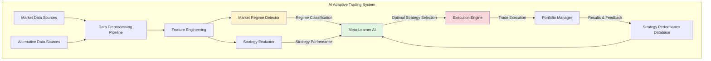
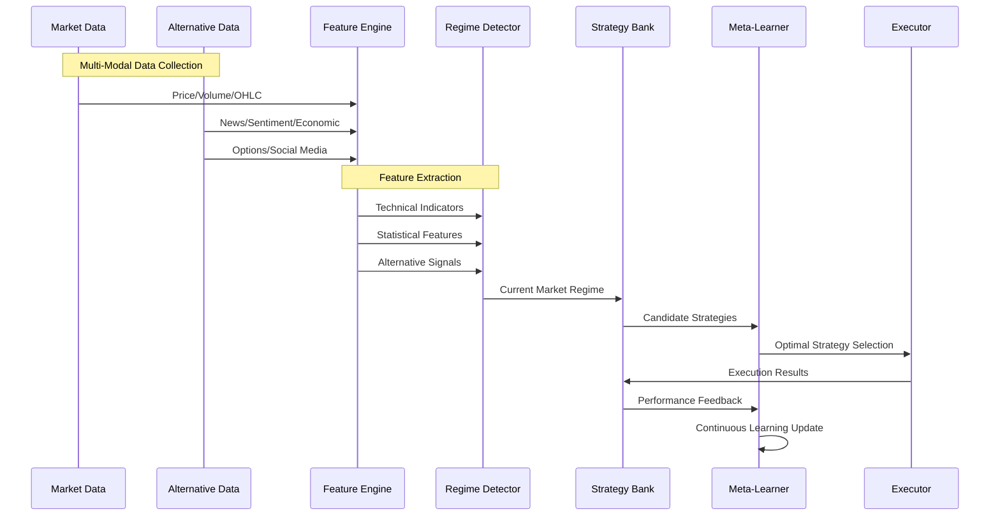
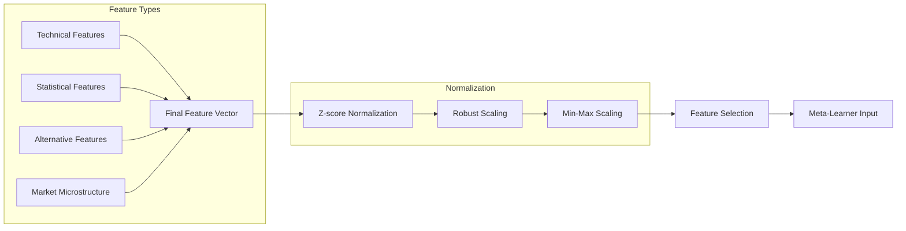
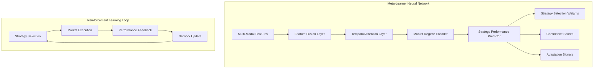

# AI-Powered Adaptive Financial Time-Series System
## Advanced Meta-Learning for Trading Strategy Selection

## 🚀 Executive Summary

This document outlines an **advanced AI-driven adaptive trading system** that goes beyond traditional price prediction. Instead of forecasting prices directly, our system **learns which trading strategies perform best under different market conditions** - a meta-learning approach to financial time-series analysis.

## 🎯 Core Philosophy: Beyond Price Prediction

Traditional financial AI focuses on:
- **Price forecasting**: "What will the price be tomorrow?"
- **Trend prediction**: "Is this an uptrend or downtrend?"

Our approach asks:
- **"Given current market conditions, which trading strategy is most effective?"**
- **"How should we adapt our methodology as market regimes change?"**
- **"What combination of data sources provides the strongest signals?"**

## 📊 System Architecture Overview



## 🔄 Data Flow Pipeline



## 📈 Trading Strategy Categories

### 1. **Trend Following Strategies**
```
├── Moving Average Crossovers (MAC)
├── MACD Trend Following
├── ADX-based Trend Strength
├── Ichimoku Cloud
└── Parabolic SAR
```

### 2. **Mean Reversion Strategies**
```
├── RSI Overbought/Oversold
├── Bollinger Band Mean Reversion
├── Stochastic Oscillator
├── Price Channel Trading
└── Statistical Arbitrage
```

### 3. **Breakout Strategies**
```
├── Support/Resistance Breakouts
├── Volatility Breakouts
├── Pattern Recognition (Head & Shoulders)
├── Cup and Handle
└── Triangle Patterns
```

### 4. **Momentum Strategies**
```
├── Rate of Change (ROC)
├── Relative Strength
├── Williams %R
├── Price Momentum Oscillator
└── TSI (True Strength Index)
```

### 5. **Volatility-Based Strategies**
```
├── ATR-based Position Sizing
├── Volatility Contraction/Expansion
├── VIX Correlation Trading
├── Bollinger Band Squeeze
└── Volatility Regime Switching
```

### 6. **Market-Making & Spread Strategies**
```
├── Bid-Ask Spread Capture
├── Statistical Arbitrage Pairs
├── Calendar Spreads
├── Volatility Surface Trading
└── ETF Arbitrage
```

## 🧠 Multi-Modal Data Integration

### **Core Market Data** (Traditional)
- **Price/Volume**: OHLC, tick data, order book
- **Technical Indicators**: 50+ indicators from our library
- **Market Microstructure**: Bid-ask spreads, depth, flow

### **Alternative Data Sources** (Innovative)
- **Economic Indicators**: GDP, inflation, employment, interest rates
- **Sentiment Analysis**: News sentiment, social media, analyst reports
- **Options Market**: Implied volatility, skew, term structure
- **Corporate Actions**: Earnings, dividends, M&A, share buybacks
- **Macro Data**: Central bank policies, geopolitical events
- **Alternative Signals**: Satellite imagery, credit card data, shipping traffic

### **Feature Engineering Pipeline**


## 🤖 Meta-Learning AI Architecture

### **Core Components**



### **Network Architecture Details**
```go
type MetaLearnerConfig struct {
    // Input dimensions
    FeatureDimensions   int
    StrategyCount       int
    RegimeCount         int
    
    // Network architecture
    HiddenLayers        []int          // [256, 128, 64]
    AttentionHeads      int           // Multi-head attention
    DropoutRate         float64       // Regularization
    LearningRate        float64
    
    // Training parameters
    BatchSize           int
    MemorySize          int           // Experience replay buffer
    Gamma               float64       // Discount factor
    UpdateFrequency     int           // Target network updates
}
```

## 🏗️ Implementation in GoNeurotic

### **Phase 1: Foundation (Week 1-2)**
```
1. Strategy Interface & Registry
   ├── Strategy interface with Execute() method
   ├── Strategy performance tracking
   ├── Strategy parameter optimization
   └── Strategy combination engine

2. Market Regime Detection Enhancement
   ├── Advanced regime classification
   ├── Regime transition detection
   ├── Regime persistence modeling
   └── Multi-timeframe regime analysis
```

### **Phase 2: AI Core (Week 3-4)**
```
3. Meta-Learner Implementation
   ├── Feature fusion neural network
   ├── Attention mechanisms for temporal data
   ├── Strategy performance prediction
   └── Reinforcement learning integration

4. Data Pipeline Expansion
   ├── Alternative data connectors
   ├── Sentiment analysis modules
   ├── Economic data integration
   └── Real-time data streaming
```

### **Phase 3: Production (Week 5-6)**
```
5. Execution Engine
   ├── Risk management layer
   ├── Portfolio optimization
   ├── Transaction cost modeling
   └── Slippage estimation

6. Backtesting & Validation
   ├── Walk-forward optimization
   ├── Out-of-sample testing
   ├── Monte Carlo simulation
   └── Performance attribution
```

## 📚 Integration with Existing GoNeurotic

### **Leveraging Current Capabilities**
```go
// Building on existing time-series infrastructure
type AdaptiveTradingSystem struct {
    // Core components
    timeseries.Pipeline           // Existing forecasting
    financial.Indicators          // Technical analysis
    neural.Network                // Neural network core
    
    // New adaptive components
    StrategySelector   MetaLearner
    RegimeDetector     AdvancedRegimeClassifier
    DataFusionEngine   MultiModalProcessor
    ExecutionManager   AdaptiveExecutor
}

// Example integration point
func (ats *AdaptiveTradingSystem) AdaptToMarket(prices []float64, 
                                               altData AlternativeData) StrategyDecision {
    // 1. Extract features from multi-modal data
    features := ats.extractFeatures(prices, altData)
    
    // 2. Detect current market regime
    regime := ats.RegimeDetector.Classify(features)
    
    // 3. Get candidate strategies for regime
    candidates := ats.StrategyBank.GetStrategiesForRegime(regime)
    
    // 4. AI selects optimal strategy
    selected := ats.StrategySelector.SelectStrategy(features, candidates)
    
    // 5. Execute with adaptive parameters
    return ats.ExecutionManager.Execute(selected, features)
}
```

## 🔬 Advanced Tutorial: Building Your Own Adaptive System

### **Tutorial 1: Market Regime Detection**
```go
package main

import (
    "github.com/goneurotic/financial"
    "github.com/goneurotic/timeseries"
)

func main() {
    // Load S&P 500 data
    data := timeseries.SP500Dataset()
    
    // Advanced regime detection
    detector := financial.NewRegimeDetector(financial.RegimeConfig{
        WindowSize: 252,           // 1 year of trading days
        RegimeCount: 5,            // Bull, Bear, Sideways, HighVol, LowVol
        Method:      "hmm",        // Hidden Markov Model
    })
    
    // Detect regimes
    regimes := detector.Detect(data.Values)
    
    // Analyze regime characteristics
    for i, regime := range regimes {
        fmt.Printf("Regime %d: %s (Duration: %d days)\n", 
                   i, regime.Type, regime.Duration)
        fmt.Printf("  Return: %.2f%%, Volatility: %.2f%%\n",
                   regime.AnnualizedReturn*100, regime.Volatility*100)
        fmt.Printf("  Best Strategy: %s (Sharpe: %.2f)\n",
                   regime.OptimalStrategy, regime.StrategySharpe)
    }
}
```

### **Tutorial 2: Strategy Performance Analysis**
```go
func analyzeStrategyPerformance(prices []float64, regimes []Regime) {
    // Initialize strategy bank
    strategies := financial.NewStrategyBank()
    
    // Register strategies
    strategies.Register("trend_following", &TrendFollowingStrategy{})
    strategies.Register("mean_reversion", &MeanReversionStrategy{})
    strategies.Register("breakout", &BreakoutStrategy{})
    strategies.Register("momentum", &MomentumStrategy{})
    
    // Test each strategy in each regime
    results := make(map[string]map[string]StrategyResult)
    
    for _, regime := range regimes {
        regimeData := prices[regime.Start:regime.End]
        
        for _, strategy := range strategies.All() {
            // Backtest strategy in this regime
            performance := strategy.Backtest(regimeData)
            
            // Store results
            if results[strategy.Name] == nil {
                results[strategy.Name] = make(map[string]StrategyResult)
            }
            results[strategy.Name][regime.Type] = performance
            
            fmt.Printf("Strategy %s in %s regime: Sharpe=%.2f, Win%%=%.1f\n",
                       strategy.Name, regime.Type,
                       performance.SharpeRatio, performance.WinRate*100)
        }
    }
    
    // Find best strategy for each regime
    bestStrategies := findOptimalStrategies(results)
    return bestStrategies
}
```

### **Tutorial 3: Building a Meta-Learner**
```go
func buildMetaLearner(strategyResults map[string]map[string]StrategyResult) {
    // Prepare training data
    var features [][]float64
    var targets []int
    
    for regimeType, regimeResults := range aggregateByRegime(strategyResults) {
        // Extract regime features
        regimeFeatures := extractRegimeFeatures(regimeType)
        
        // Find best performing strategy
        bestStrategy := findBestStrategy(regimeResults)
        
        // Add to training data
        features = append(features, regimeFeatures)
        targets = append(targets, strategyToIndex(bestStrategy))
    }
    
    // Create meta-learner network
    config := neural.NetworkConfig{
        LayerSizes:       []int{len(features[0]), 64, 32, len(strategyResults)},
        Activation:       neural.ReLU,
        OutputActivation: neural.Softmax,
        LossFunction:     neural.CrossEntropy,
    }
    
    metaLearner := neural.NewNetwork(config)
    
    // Train to predict best strategy from regime features
    for epoch := 0; epoch < 1000; epoch++ {
        for i := range features {
            metaLearner.Train(features[i], oneHot(targets[i], len(strategyResults)))
        }
    }
    
    // Test meta-learner
    testRegime := extractRegimeFeatures("high_volatility")
    prediction := metaLearner.Predict(testRegime)
    selectedStrategy := indexToStrategy(argmax(prediction))
    
    fmt.Printf("For high volatility regime, AI recommends: %s\n", selectedStrategy)
}
```

## 🎯 Performance Metrics & Validation

### **Primary Metrics**
```
1. Strategy Selection Accuracy
   ├── Percentage of correct strategy selections
   ├── Risk-adjusted returns vs benchmark
   └── Win rate improvement

2. Adaptive Performance
   ├── Regime transition capture speed
   ├── Strategy switching effectiveness
   └── Drawdown reduction

3. Economic Value
   ├── Sharpe ratio improvement
   ├── Maximum drawdown reduction
   └── Consistency across market cycles
```

### **Validation Framework**

```mermaid
graph TB
    subgraph "Multi-Stage Validation"
        IS[In-Sample Training] --> OOS[Out-of-Sample Testing]
        OOS --> WF[Walk-Forward Validation]
        WF --> MC[Monte Carlo Simulation]
        MC --> ST[Stress Testing]
        ST --> EP[Economic Plausibility Check]
    end
    
    subgraph "Robustness Tests"
        PT[Parameter Sensitivity] --> RT[Regime Transition Tests]
        RT --> MD[Market Condition Tests]
        MD --> TC[Transaction Cost Analysis]
        TC --> Final[Final Validation]
    end
```


## 🔮 Future Extensions & Research Directions

### **Short-term (3-6 months)**
1. **Deep Reinforcement Learning**: Advanced policy gradients for strategy selection
2. **Transfer Learning**: Apply knowledge across different asset classes
3. **Ensemble Methods**: Combine multiple meta-learners
4. **Explainable AI**: Interpretable strategy selection decisions

### **Medium-term (6-12 months)**
1. **Multi-Agent Systems**: Competing/cooperating AI traders
2. **Alternative Data Expansion**: IoT, satellite, blockchain data
3. **Quantum Machine Learning**: Quantum-enhanced optimization
4. **Federated Learning**: Privacy-preserving collaborative learning

### **Long-term (1-2 years)**
1. **Autonomous Portfolio Management**: End-to-end AI portfolio construction
2. **Cross-Asset Allocation**: Multi-asset class adaptive allocation
3. **Macro Strategy Integration**: Combining trading with macroeconomic views
4. **Ethical AI Trading**: Incorporating ESG and ethical considerations

## 🚀 Getting Started

### **Quick Start Example**
```go
package main

import (
    "fmt"
    "github.com/goneurotic/financial/adaptive"
)

func main() {
    // Initialize adaptive trading system
    system := adaptive.NewAdaptiveSystem(adaptive.Config{
        DataSources:   []string{"prices", "sentiment", "options"},
        Strategies:    []string{"trend", "reversion", "breakout"},
        LearningMode:  "reinforcement",
        RiskBudget:    0.02, // 2% risk per trade
    })
    
    // Load historical data
    system.LoadData("sp500_2020_2024.csv")
    
    // Train the meta-learner
    system.Train()
    
    // Run adaptive backtest
    results := system.Backtest()
    
    fmt.Printf("Adaptive System Performance:\n")
    fmt.Printf("  Total Return: %.2f%%\n", results.TotalReturn*100)
    fmt.Printf("  Sharpe Ratio: %.2f\n", results.SharpeRatio)
    fmt.Printf("  Max Drawdown: %.2f%%\n", results.MaxDrawdown*100)
    fmt.Printf("  Strategy Switch Count: %d\n", results.StrategySwitches)
    
    // Analyze regime-adaptive performance
    for regime, perf := range results.RegimePerformance {
        fmt.Printf("\n%s Regime Performance:\n", regime)
        fmt.Printf("  Most Used Strategy: %s\n", perf.MostUsedStrategy)
        fmt.Printf("  Regime Sharpe: %.2f\n", perf.SharpeRatio)
    }
}
```

## 📚 Educational Resources

### **Core Concepts to Master**
1. **Market Microstructure**: Understanding how markets actually work
2. **Statistical Arbitrage**: Mean reversion and cointegration
3. **Machine Learning**: Supervised, unsupervised, reinforcement learning
4. **Risk Management**: Position sizing, drawdown control, portfolio theory
5. **Alternative Data**: Non-traditional data sources and feature engineering

### **Recommended Study Path**
```
Week 1-2: Financial Markets & Time Series Basics
Week 3-4: Technical Analysis & Statistical Methods
Week 5-6: Machine Learning for Finance
Week 7-8: Alternative Data & Feature Engineering
Week 9-10: Meta-Learning & Adaptive Systems
Week 11-12: Implementation & Backtesting
```

## 🎓 Conclusion

This AI-powered adaptive financial time-series system represents a **paradigm shift** from traditional forecasting to **intelligent strategy selection**. By learning which methodologies work best in different market conditions and continuously adapting to changing environments, we create a more robust and intelligent trading system.

The integration with GoNeurotic provides a **production-ready foundation** for both educational exploration and real-world deployment, combining the power of neural networks with financial domain expertise.

---

**Key Innovation**: Instead of asking "What will happen?" we ask "What should we do?" - shifting from prediction to intelligent action in financial markets.

**Educational Value**: This system teaches not just how to predict markets, but how to think adaptively about trading strategy selection - a crucial skill for modern quantitative finance.

**Practical Impact**: By dynamically selecting the best tools for current market conditions, we can potentially achieve more consistent returns with lower drawdowns across different market regimes.
```

This comprehensive design document outlines an innovative AI-powered adaptive trading system that goes beyond traditional price prediction. The system uses meta-learning to select optimal trading strategies based on current market conditions, integrates multiple data sources (not just price data), and provides a framework for both education and practical implementation within the GoNeurotic ecosystem.