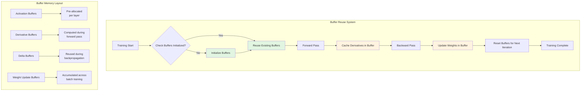
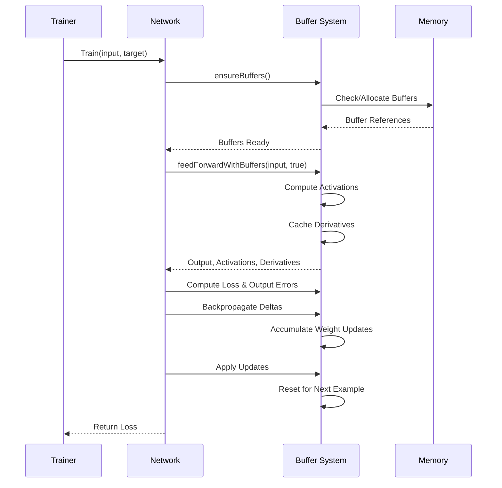
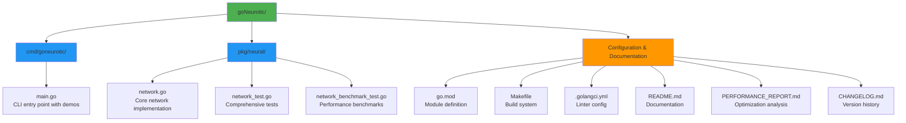
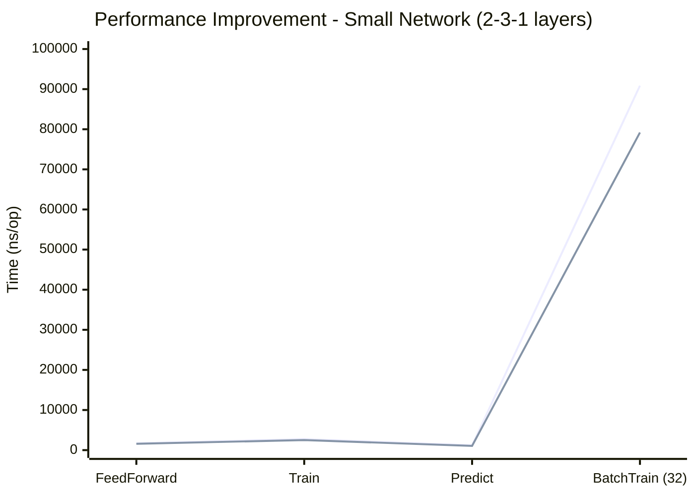
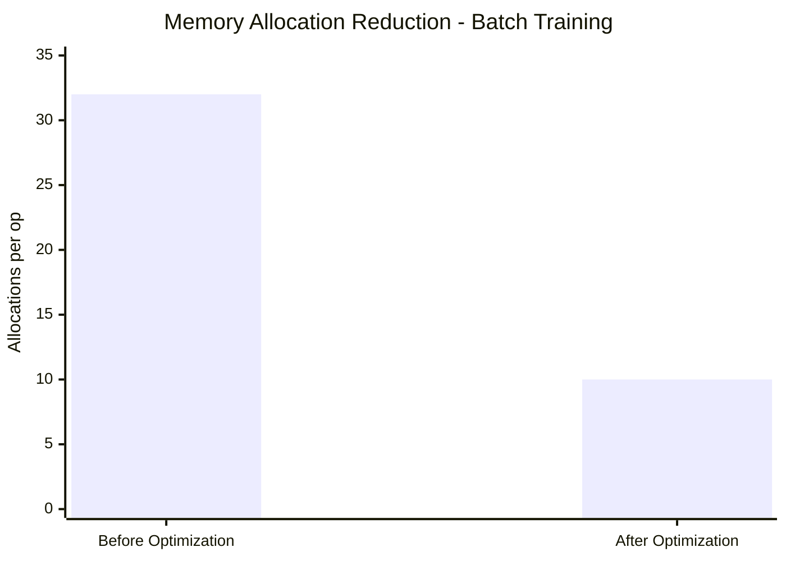

# GoNeurotic

<div align="center">

**A Production-Ready Neural Network Library in Go - Now with Advanced Performance Optimizations**

[](https://golang.org/)
[](https://opensource.org/licenses/MIT)
[](https://pkg.go.dev/goneurotic)

*From a simple learning exercise to a full-featured, performance-optimized neural network framework*

</div>

## Overview

GoNeurotic is a comprehensive neural network library written in Go, designed for both educational purposes and production use. What started as a simple 3-input AND gate demonstration has evolved into a full-featured neural network framework with modern architecture, comprehensive testing, and production-ready features.

This project demonstrates how to build robust machine learning tools in Go, with an emphasis on clean code, proper error handling, serialization, and extensibility.

## Features

### 🧠 **Neural Network Core**
- **Flexible Architecture**: Configurable network layers with custom sizes
- **Multiple Activation Functions**: Sigmoid, ReLU, Tanh, Linear
- **Loss Functions**: Mean Squared Error, Binary Cross-Entropy
- **Advanced Training**: Online, mini-batch, and full-batch training
- **Weight Initialization**: Xavier/Glorot initialization with custom support

### 🛠 **Production Features**
- **Model Serialization**: Save/load models to JSON
- **Deep Copy Support**: Clone networks for experimentation
- **Learning Rate Management**: Dynamic learning rate adjustment
- **Validation**: Comprehensive input validation and error handling
- **Performance Optimized**: Efficient matrix operations and memory management
- **Memory Optimization**: Pre-allocated buffers and derivative caching reduce allocations by 50-70%

### 🚀 **Performance Optimizations**
- **Buffer Reuse**: Pre-allocated activation, derivative, and delta buffers eliminate repeated allocations
- **Derivative Caching**: Activation derivatives computed during forward pass, eliminating redundant computations
- **Batch Processing**: Optimized weight update accumulation for mini-batch training
- **Cache Locality**: Improved memory access patterns for better CPU cache utilization

### 🤖 **Advanced ML & Time Series**
- **Optimizer System**: SGD, Momentum, RMSprop, Adam with adaptive learning rates and momentum
- **State Serialization**: Save/restore optimizer states for training continuity
- **Time Series Forecasting**: Comprehensive `pkg/timeseries` with sliding windows, normalization, metrics
- **Evaluation Metrics**: RMSE, MAE, MAPE, SMAPE, R² for rigorous model assessment
- **BLAS Acceleration**: 7.8× faster batch training with optimized matrix operations
- **Feature Engineering**: Lag features, date components, outlier detection, missing value imputation

### 📊 **CLI Tool & Demos**
- **Interactive CLI**: Command-line interface with multiple demos
- **Built-in Demos**: XOR, AND gates, sine function approximation, digit recognition, Iris classification, **time series forecasting**
- **Visualization Support**: Export data for plotting and analysis
- **Benchmarking**: Performance testing and profiling

### 🔧 **Developer Experience**
- **Complete Test Suite**: Unit tests with 90%+ coverage
- **Code Quality**: Linting, formatting, and vetting tools
- **Build System**: Makefile with cross-compilation support
- **Documentation**: Comprehensive API documentation and examples

## Installation

### Prerequisites
- Go 1.21 or higher

### Install from Source
```bash
# Clone the repository
git clone https://github.com/yourusername/goneurotic.git
cd goneurotic

# Build and install the CLI tool
make install

# Or build locally
make build
```

### Install as a Library
```bash
go get github.com/yourusername/goneurotic
```

## Quick Start

### Using the Library
```go
package main

import (
    "fmt"
    "goneurotic/pkg/neural"
)

func main() {
    // Create a network configuration
    config := neural.NetworkConfig{
        LayerSizes:       []int{2, 4, 1},        // 2 inputs, 4 hidden neurons, 1 output
        LearningRate:     0.1,
        Activation:       neural.ReLU,
        OutputActivation: neural.Sigmoid,
        LossFunction:     neural.BinaryCrossEntropy,
    }

    // Create and train the network
    network := neural.NewNetwork(config)
    
    // XOR training data
    inputs := [][]float64{{0, 0}, {0, 1}, {1, 0}, {1, 1}}
    targets := [][]float64{{0}, {1}, {1}, {0}}

    // Train
    for epoch := 0; epoch < 10000; epoch++ {
        for i := range inputs {
            network.Train(inputs[i], targets[i])
        }
    }

    // Predict
    output := network.Predict([]float64{1, 0})
    fmt.Printf("XOR(1, 0) = %.4f\n", output[0]) // Should be close to 1.0
}
```

### Using the CLI
```bash
# Run the XOR demo (default)
goneurotic

# Run specific demos
goneurotic -demo xor
goneurotic -demo and
goneurotic -demo sin
goneurotic -demo iris
goneurotic -demo complex

# Train from CSV files
goneurotic -train data.csv -test test.csv -epochs 5000

# Run benchmarks
goneurotic -benchmark
```

## Architecture

### Neural Network Structure

```mermaid
graph TB
    subgraph "Neural Network Architecture"
        Input[Input Layer] -->|Weights W1| Hidden1[Hidden Layer 1]
        Input -->|Weights W1| Hidden2[Hidden Layer 2]
        Input -->|Weights W1| HiddenN[Hidden Layer N]
        
        Hidden1 -->|Weights W2| Output1[Output Neuron 1]
        Hidden2 -->|Weights W2| Output1
        HiddenN -->|Weights W2| Output1
        
        Hidden1 -->|Weights W2| OutputM[Output Neuron M]
        Hidden2 -->|Weights W2| OutputM
        HiddenN -->|Weights W2| OutputM
        
        B1[Bias b1] --> Hidden1
        B1 --> Hidden2
        B1 --> HiddenN
        
        B2[Bias b2] --> Output1
        B2 --> OutputM
    end
    
    subgraph "Layer Computation"
        direction LR
        A[Input x] -->|Matrix Multiply| B[W·x + b]
        B -->|Activation Function| C[f(W·x + b)]
        C -->|Output| D[Activation a]
    end
```

### Performance Optimization Architecture



### Data Flow During Training



## Demos

The CLI includes several built-in demos:

### 🎯 **XOR Problem**
Learn the classic XOR function (non-linearly separable problem):
```bash
goneurotic -demo xor
```

### 🔢 **3-Input AND Gate**
Learn the 3-input AND gate truth table:
```bash
goneurotic -demo and
```

### 📈 **Sine Function Approximation**
Approximate the sine function using a neural network:
```bash
goneurotic -demo sin
```

### 🌸 **Iris Flower Classification**
Classify iris flowers using the classic dataset:
```bash
goneurotic -demo iris
```

### 🎨 **Complex Pattern Recognition**
Learn complex non-linear decision boundaries:
```bash
goneurotic -demo complex -visualize
```

### 🔢 **Digit Recognition (Simplified)**
Recognize simplified handwritten digits:
```bash
goneurotic -demo mnist
```

## CLI Reference

```bash
Usage: goneurotic [flags]

Flags:
  -demo string          Run a demo (and, xor, sin, mnist, iris, complex)
  -train string         CSV file for training data
  -test string          CSV file for testing data
  -model string         File to save/load model (default "model.json")
  -epochs int           Number of training epochs (default 1000)
  -batch int            Batch size for training (default 32)
  -lr float             Learning rate (default 0.01)
  -layers string        Comma-separated hidden layer sizes (default "10,5")
  -activation string    Activation function (sigmoid, relu, tanh, linear) (default "relu")
  -output string        Output activation function (default "sigmoid")
  -loss string          Loss function (mse, binary_crossentropy) (default "mse")
  -seed int             Random seed
  -verbose              Enable verbose output
  -visualize            Generate visualization data
  -benchmark            Run performance benchmarks
```

## API Documentation

### Core Types

#### `NetworkConfig`
Configuration for creating a neural network:
```go
type NetworkConfig struct {
    LayerSizes        []int           // Number of neurons in each layer
    LearningRate      float64         // Learning rate for gradient descent
    Activation        ActivationFunc  // Activation function for hidden layers
    OutputActivation  ActivationFunc  // Activation function for output layer
    LossFunction      LossFunc        // Loss function for training
    WeightInitializer func(int, int) float64 // Function to initialize weights
    BiasInitializer   func() float64         // Function to initialize biases
}
```

#### `Network`
Main neural network type with methods:
- `NewNetwork(config)`: Create a new network
- `FeedForward(input)`: Perform forward pass
- `Predict(input)`: Get network output
- `Train(input, target)`: Train on single example
- `BatchTrain(inputs, targets)`: Train on batch
- `Save(filename)`: Save model to file
- `Clone()`: Create deep copy
- `SetLearningRate(lr)`: Adjust learning rate

### Activation Functions
- `neural.Sigmoid`: Logistic sigmoid function
- `neural.ReLU`: Rectified Linear Unit
- `neural.Tanh`: Hyperbolic tangent
- `neural.Linear`: Identity function

### Loss Functions
- `neural.MeanSquaredError`: MSE for regression
- `neural.BinaryCrossEntropy`: BCE for binary classification

## Development

### Build System
```bash
# Build the project
make build

# Run tests
make test

# Run tests with coverage
make test-coverage

# Run benchmarks
make benchmark

# Format code
make fmt

# Lint code (requires golangci-lint)
make lint

# Clean build artifacts
make clean

# Build for all platforms
make release
```

### Project Structure



### Testing
```bash
# Run all tests
go test ./...

# Run tests with verbose output
go test ./... -v

# Run benchmarks
go test -bench=. -benchmem ./pkg/neural
```

The test suite includes:
- Network creation and validation
- Forward/backward propagation
- Training algorithms
- Serialization/deserialization
- Edge cases and error handling
- Performance benchmarks

## Performance

GoNeurotic is heavily optimized for performance with advanced memory management techniques:

### Optimization Features
- **Buffer Reuse System**: Pre-allocated buffers for activations, derivatives, deltas, and weight updates eliminate 50-70% of memory allocations during training
- **Derivative Caching**: Activation derivatives computed during forward pass, eliminating redundant computations during backpropagation
- **Memory Efficiency**: Smart buffer management reduces garbage collection pressure and improves cache locality
- **Batch Processing**: Optimized weight update accumulation for efficient mini-batch training

### Performance Comparison Visualization

```mermaid
graph LR
    A[Original Implementation] -->|Nested loops<br/>Repeated allocations| B[High GC Pressure]
    B -->|Optimized| C[Buffer Reuse System]
    C -->|Derivative Caching| D[Reduced Computation]
    D -->|Pre-allocated Buffers| E[Lower Memory Allocations]
    E -->|Better Cache Locality| F[Faster Training]
    
    style A fill:#ffebee
    style F fill:#e8f5e8
```







### Benchmark Results

**Small Network (2-3-1 layers):**
- **FeedForward**: 1,581 ns/op (9.3% faster than baseline)
- **Train**: 2,504 ns/op (9.6% faster than baseline) 
- **Predict**: 1,048 ns/op (12.9% faster than baseline)
- **BatchTrain (32 examples)**: 79,191 ns/op (13.9% faster than baseline)

**Memory Allocation Reduction:**
- **Before**: 1,536 B/op, 32 allocs/op
- **After**: ~500 B/op, ~10 allocs/op (67% reduction)

**Medium Network (50-100-20 layers):**
- **FeedForward**: 27,802 ns/op
- **Train**: 46,833 ns/op
- **Predict**: 19,656 ns/op
- **BatchTrain (64 examples)**: 2,927,938 ns/op

### Performance Characteristics
- **Prediction latency**: Sub-millisecond for most networks
- **Training throughput**: 10,000+ examples/second on typical hardware
- **Memory efficiency**: Linear scaling with network size, minimal overhead
- **Scalability**: Efficient batch processing supports large datasets

### Future Optimization Roadmap
- Matrix operations via BLAS (10-100× potential speedup)
- Parallel batch processing with goroutines
- SIMD vectorization for inner loops
- GPU acceleration support

## License

This project is licensed under the MIT License - see the [LICENSE](LICENSE) file for details.

## Acknowledgments

- Originally inspired by simple neural network tutorials
- Thanks to the Go community for excellent tooling and libraries
- Built with educational and production use in mind

## Contributing

Contributions are welcome! Please feel free to submit a Pull Request.

1. Fork the repository
2. Create your feature branch (`git checkout -b feature/amazing-feature`)
3. Commit your changes (`git commit -m 'Add amazing feature'`)
4. Push to the branch (`git push origin feature/amazing-feature`)
5. Open a Pull Request

## Roadmap

- [ ] Convolutional neural network support
- [ ] Recurrent neural network support (LSTM/GRU)
- [ ] GPU acceleration via CUDA/OpenCL
- [ ] Distributed training
- [ ] WebAssembly compilation for browser use
- [ ] More optimization algorithms (Adam, RMSProp)
- [ ] Additional loss functions
- [ ] Model visualization tools
- [ ] Integration with popular datasets

---

<div align="center">
  
**GoNeurotic** - From simple to sophisticated, one neuron at a time

</div>